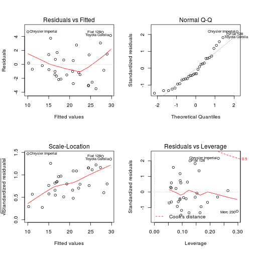

The Relationship between Transmission Type and Miles per Gallon
========================================================

# Executive Summary

For this analysis, we will look at the the publicly available Motor Trends set of data in R called mtcars.  We will then use graphical exploratory data analysis and regression to determine if there is a relationship between the type of transmission in a car and the car's miles per gallon fuel efficiency.

The analysis is organized into the following sections:  
1. Exploratory Data Analysis  
2. Regression Analysis - Model creation and selection  
3. Coefficient Interpretation, Analysis, and Answer to Question  
4. Residual Plot and Diagnostics  

# Exploratory Data Analysis

In order to determine whether regression would be an appropriate tool to use for analyzing the mtcars data set and determining whether there is a relationship between transmission type and miles per gallon efficiency, we must first determine whether the data set follows a normal distribution.  A histogram is useful in determining quickly whether the data set distribution follows a normal bell curve shape:


```r
hist(mtcars$mpg, breaks = 10, xlab = "MPG", main = "Miles per Gallon Distribution", col = "blue")
```

 

We can also use exploratory data analysis to determine if there is relationship between the transmission type and the miles per gallon efficiency.  A boxplot is one example of a useful tool for this type of analysis:


```r
boxplot(mpg ~ am, data = mtcars, main = "Miles per Gallon by Transmission Type", xlab = "Transmission Type", ylab = "MPG")
```

 

We can see from both figures above that regression is an appropriate tool (the population follows a normal distribution) and there appears to be a relationship between fuel efficiency and transmission type.

# Regression Analysis

## Model Creation and Model Selection

In order to determine the relationship between fuel efficiency and transmission type, we'll look at models that use simple linear regression with one predictor, with all columns as predictors for miles per gallon, and with a model that uses steps to determine the best model (a type of boosted regression).

Here is the simple linear regression that uses one predictor:


```r
simplemodel <- lm(mpg ~ am, data = mtcars)
```

Here is the regression model that uses all predictors:


```r
complexmodel <- lm(mpg ~ ., data = mtcars)
```

Finally, here is the model that uses the step function to determine the best model (highest predictive value with the least number of predictors):


```r
bestmodel <- step(complexmodel, trace=0)
summary(bestmodel)
```

```
## 
## Call:
## lm(formula = mpg ~ wt + qsec + am, data = mtcars)
## 
## Residuals:
##     Min      1Q  Median      3Q     Max 
## -3.4811 -1.5555 -0.7257  1.4110  4.6610 
## 
## Coefficients:
##             Estimate Std. Error t value Pr(>|t|)    
## (Intercept)   9.6178     6.9596   1.382 0.177915    
## wt           -3.9165     0.7112  -5.507 6.95e-06 ***
## qsec          1.2259     0.2887   4.247 0.000216 ***
## am            2.9358     1.4109   2.081 0.046716 *  
## ---
## Signif. codes:  0 '***' 0.001 '**' 0.01 '*' 0.05 '.' 0.1 ' ' 1
## 
## Residual standard error: 2.459 on 28 degrees of freedom
## Multiple R-squared:  0.8497,	Adjusted R-squared:  0.8336 
## F-statistic: 52.75 on 3 and 28 DF,  p-value: 1.21e-11
```

The best model uses three coefficients that results in an R-squared value of 84.97%.  This is the best model for our analysis as it is the most efficient model and also results in a very large amount of data being fitted to the regression line.  

# Coefficient Interpretation, Analysis, and Answer to Question

In the analysis above, the amManual estimate of 2.9358 is an indicator of expected change in MPG due to transmission type. In other words, the expected change in fuel efficiency between a manual transmission and an automatic transmission is about 3 miles per gallon (with the manual transmission having the better fuel economy).

# Residual Plot and Diagnostics

Finally, in order to determine how well our model explains the data, we can use a combination of residual vs. fitted, noraml Q-Q, Scale-Location, and Residuals vs. Leverage plots to visually determine the fit of our model to the data:


```r
par(mfrow = c(2,2))
plot(bestmodel)
```

 
