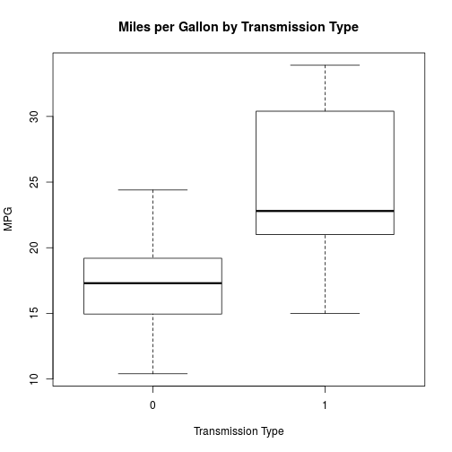

The Relationship between Transmission Type and Miles per Gallon
========================================================

# Executive Summary

For this analysis, we will look at the the publicly available Motor Trends set of data in R called mtcars.  We will then use graphical exploratory data analysis and regression to determine if there is a relationship between the type of transmission in a car and the car's miles per gallon fuel efficiency.

The analysis is organized into the following sections:  
1. Exploratory Data Analysis  
2. Regression Analysis  
 a. Model creation  
 b. Coefficient Interpretation  
 c. Alternative Models and Model Selection  
3. Analysis and Answer to Question  
4. Residual Plot and Diagnostics  

# Exploratory Data Analysis

In order to determine whether regression would be an appropriate tool to use for analyzing the mtcars data set and determining whether there is a relationship between transmission type and miles per gallon efficiency, we must first determine whether the data set follows a normal distribution.  A histogram is useful in determining quickly whether the data set distribution follows a normal bell curve shape:


```r
hist(mtcars$mpg, breaks = 10, xlab = "MPG", main = "Miles per Gallon Distribution", col = "blue")
```

 

We can also use exploratory data analysis to determine if there is relationship between the transmission type and the miles per gallon efficiency.  A boxplot is one example of a useful tool for this type of analysis:


```r
boxplot(mpg ~ am, data = mtcars, main = "Miles per Gallon by Transmission Type", xlab = "Transmission Type", ylab = "MPG")
```

 


You can also embed plots, for example:


```r
plot(cars)
```

 

